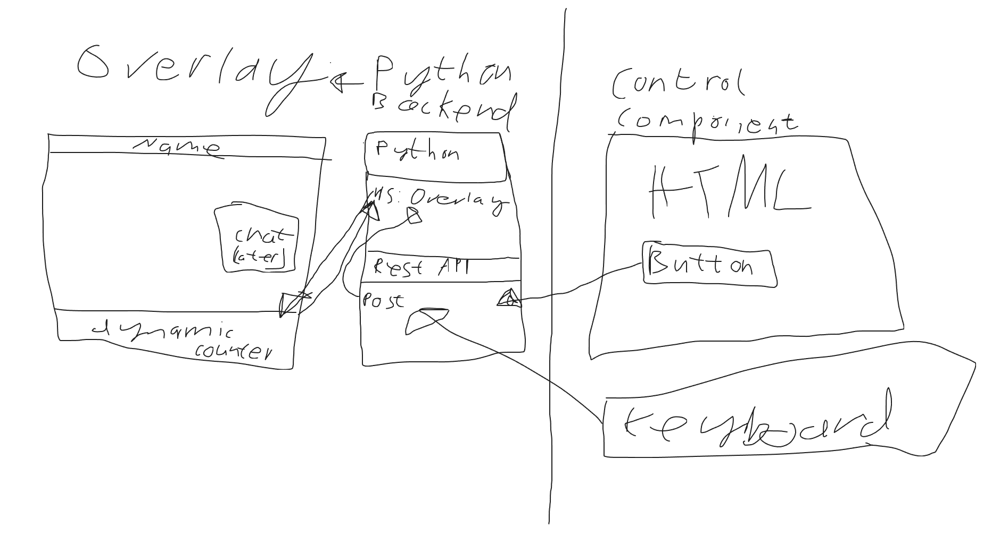

# OBS Twitch Overlay

Building an overlay for twitch
using python as a backend and static html pages with some svelte for state.

## Building in Stream

This project will be build in my stream every Tuesday, starting on Jan. 6 2026, 8 PM.
I will also upload videos from the stream but cannot promise a constant schedule there.

In the stream itself, the overlay will be build and also displayed while it is build. 
So you can actively participate and suggest enhancements to the overlay!

It uses an architecture where the overlay is a static HTML page with some svelte for state. 
The HTML is provided by a python backend. Anything further will be implemented in the next streams.

## Future

The idea of this project will be stretched over multiple Twitch streams and thus multiple 
YouTube Videos.

The main idea is to build an overlay for twitch with bot integration and the possibility to
integrate any feature you'd like.

The first mile stone will be to build an overlay in general,
which can display static parts and also use type script to make some dynamic content.
The python backend will here deploy the static html page which has some TS in it for the dynamic parts.  
This was already achieved in the first stream.

In the second stream we will add a web socket and add a controlling component to change what is
displayed on the frontend dynamically.

This is a sketch of the architecture drawn in the first stream.

